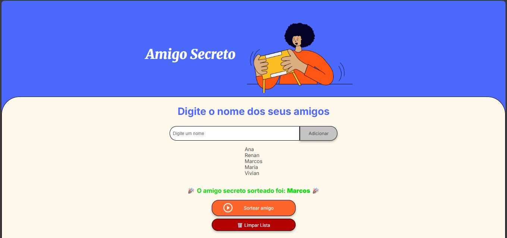

# 🎁 Projeto Amigo Secreto

Uma aplicação simples em **HTML, CSS e JavaScript** que permite adicionar nomes de amigos a uma lista e realizar um sorteio aleatório para descobrir quem será o **amigo secreto**.  

## 📌 Funcionalidades

- Adicionar nomes à lista por meio de um campo de texto.  
- Validação de entrada (não permite adicionar nomes vazios).  
- Exibição da lista de amigos em tempo real.  
- Sorteio aleatório de um nome da lista.  
- Botão para **limpar toda a lista** e recomeçar.  

## 🛠️ Tecnologias utilizadas

- **HTML5** → Estrutura da página  
- **CSS3** → Estilização e responsividade  
- **JavaScript (Vanilla JS)** → Lógica da aplicação  

## 🚀 Como usar

1. Clone este repositório ou baixe os arquivos.  
   ```bash
   git clone https://github.com/DiegoMN011/jogo-do-amigo-secreto
   ```

2. Abra o arquivo `index.html` no navegador.  

3. Digite os nomes dos amigos no campo de texto e clique em **Adicionar**.  

4. Quando todos os nomes estiverem na lista, clique em **Sortear Amigo** para escolher aleatoriamente.  

5. Caso queira começar de novo, clique em **Limpar Lista**.  

## 📂 Estrutura de pastas

```
📁 amigo-secreto
│── index.html        # Estrutura principal
│── style.css         # Estilização
│── app.js            # Lógica em JavaScript
│── assets/           # Imagens e ícones utilizados
│── README.md         # Documentação do projeto
```

## 📸 Prévia da aplicação



## 📌 Melhorias futuras

- [ ] Adicionar botão ❌ para remover amigos individualmente.  
- [ ] Impedir que nomes duplicados sejam adicionados.  
- [ ] Salvar lista no **LocalStorage** para não perder ao recarregar a página.  

---

Feito com ❤️ em **JavaScript** para praticar lógica de programação e manipulação do DOM.  
